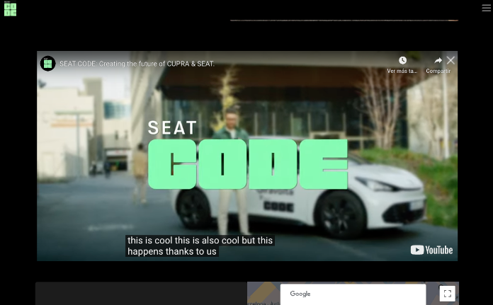

# SEAT CODE WEBSITE
At SEAT CODE, we’re always moving forward. As the digital hub for CUPRA and SEAT, we create solutions that transform user experiences, optimise operations and accelerate innovation. Our End-to-End approach ensures agile development of the highest-quality digital solutions and fast delivery times. As the Volkswagen Group’s go-to coders, our digital products are fully scalable and user centric. Our goal is to keep transforming the status quo. See how we’re shaping the future of mobility.

url: https://code.seat

## Objective
Driving Digital Transformation: SEAT:CODE focuses on creating smart, scalable digital solutions that improve user experiences, especially in mobility and automotive sectors.

Innovation and Agility: We aim to deliver innovative products quickly through agile, user-centered design processes.

Expertise and Collaboration: SEAT:CODE highlights its diverse team of digital innovators working in collaboration to transform the automotive industry's digital landscape.

Showcase Digital Products: The website showcases we work in developing digital applications and services that aim to revolutionize mobility experiences.




# Getting Started the app

Before running any command if you want to run the application at your localhost you should run these commands:
```
git clone https://github.com/seatcode/seatcode-web-new.git;

npm install
```
Then you should have the project & its dependencies.

## Available Scripts

In the project directory, you can run:

### `npm run dev`

Runs the app in the development mode.\
Open [http://localhost:3000](http://localhost:3000) to view it in the browser.

The page will reload if you make edits.\
You will also see any lint errors in the console.

Once logged into the Home page, the user can choose several views at navbar or footer to display different lawful info.

## Learn More

You can learn more in the [Vite documentation](https://vite.dev/guide/).

To learn React, check out the [React documentation](https://reactjs.org/).

## Architecture

### **Deploy**

GitHub pages

### **Theme and styles**
Styles managed with Styled Components. 
Shared theme defined and injected to the App.

### **Node**
**Node version** -  v20.15.0.


